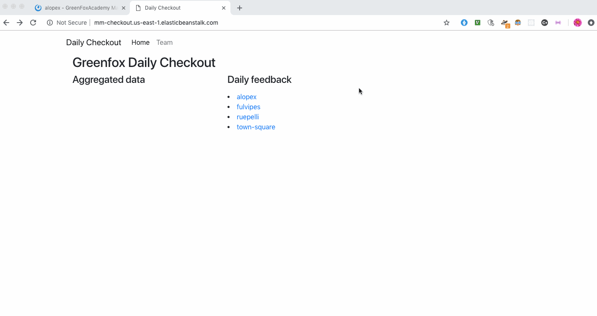

# Checkout Feedback Form Application for Mattermost 

## Preview:

## Current Features:
* Slash command integration in Mattermost to retrieve interactive message to direct Green Fox students to a React form link
* Form using react-jsonschema-form library to submit feedback, passing down specific Mattermost channel and username into form URL as query string
* REST API endpoints to submit and retrieve feedback from MySQL database, using superagent and fetch
* DOM manipulation with Node.JS Npm Express and EJS templating to display feedback from database based on Mattermost channel and date
* Bootstrap for CSS layout
* Mattermost hosted on AWS EC2 instance using Docker container
* React-based form hosted on AWS S3 bucket
* Checkout application itself hosted on AWS Elastic Beanstalk environment using continuous deployment via Jenkins (using GitHub webhook and Docker)

### Front-End React Form
* [React Form Code](https://github.com/green-fox-academy/mm-checkout-frontend)

## Next steps:
1. Improve feedback form design 
2. Integrate form into Mattermost channels via Mattermost's interactive dialog feature
3. Develop and deploy feedback aggregation feature

## Project steps:
### Backend: 
1. Send POST request with feedback to database - done
2. Ensure authentication works - done, with mattermost token/message
3. Make sure channel pages work and list all feedback by date/channel as needed - done
4. Deploy to AWS - done

### Frontend: 
1. Create checkout form as Mattermost slash command - done
2. Use React :) - done
3. Ensure numbers and scripts all in one form - done
4. Ensure that pressing submit button sends feedback to backend to submit to database, with correct body names - done
5. Make it pretty :) 
6. Deploy to AWS - done

### Database: 
1. Make sure database tables work well with what feedback form submits - done
2. Ensure aggregation of data works based on former GF Checkout Spring app (ideally split out this part of old app as stand-alone app)
3. Make sure aggregated data ends up in team_checkout table 
